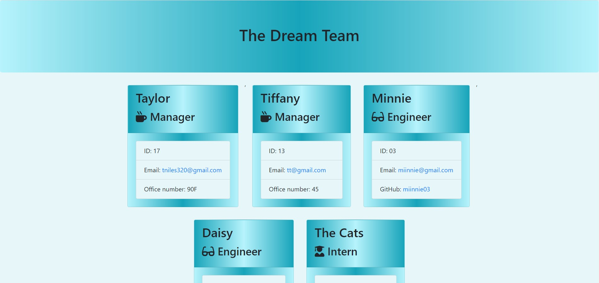
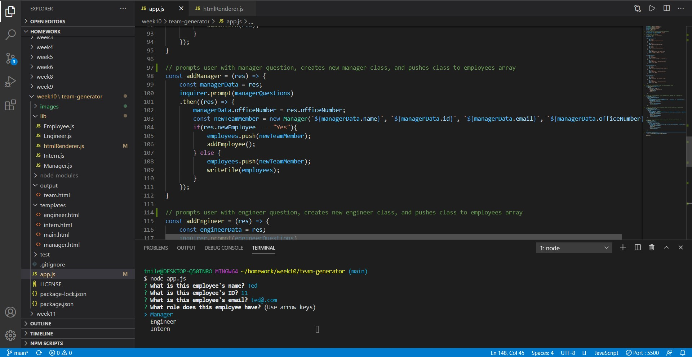

# Team Generator

## Description

The Team generator allows a user quickly generate a website showcasing their team of employees. The user is prompted with a list of questions that differs depending on the employee role. The information that is generated is displayed on a single page and includes links to email and/or GitHub.

## Table of Contents 

* [Installation](#installation)

* [Usage](#usage)

* [License](#license)

* [Contribution Guidelines](#contribution-guidelines)

* [Tests](#tests)

* [Questions](#questions)

## Installation

Run the following command to install dependencies:

_npm install_

## Usage

To use this application run the app.js file in the terminal and answer a series of prompts.

## License

This project is licensed under MIT

## Contribution Guidelines

Currently there are no contribution guidelines for this repo.

## Tests

Run the following command in the terminal to run tests:

_npm test_

## Questions

If you have any questions regarding this repo, you may contact me at tniles320@gmail.com. To see my other work, follow this link: [GitHub](https://github.com/tniles320/).